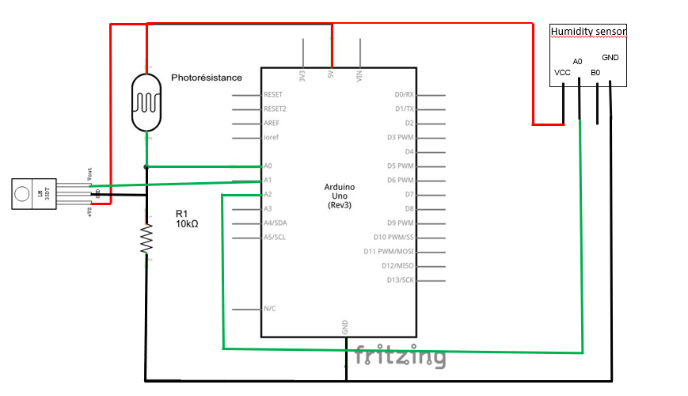

# Informations relatives au câblage

## Tableau des broches :

| Arduino       |     photorésistor     |     DHT11      |  ESP8266 | LM35 |
| :------------ | :-------------:       | -------------: | :------: | :---:|
| 5V            |     VCC               |     VCC        |          |  VCC |
| 3.3V          |                       |                |VIN/ENABLE|      |
|GND            |      GND              | GND            |     GND  |  GND | 
| A0            |      GND              |                |          |      |
| A1            |                       |                |          | VOUT |
| D7            |                       |    DATA        |          |      | 
| RX            |                       |                |   TX     |      |
| TX            |                       |                |   RX     |      |

## Câblage des capteurs

## Câblage du module WiFi

